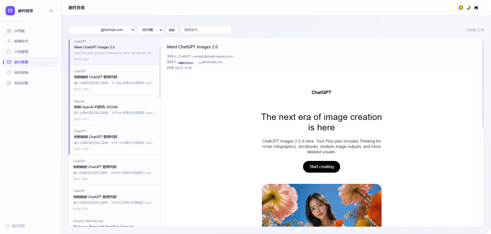

# 📬 Outlook 邮件管理

<div align="center">

**基于 Cloudflare Workers 的轻量级 Outlook 邮件管理工具**

🆓 完全免费 · ☁️ 无需服务器 · 🌍 全球加速 · 🌗 深浅主题 · 🌐 中英双语

[](./LICENSE)
[](https://www.typescriptlang.org/)
[](https://workers.cloudflare.com/)
[](https://hono.dev/)
[](https://developers.cloudflare.com/d1/)
[](https://github.com/roseforyou/cf-outlook-email/pulls)

[](https://deploy.workers.cloudflare.com/?url=https://github.com/roseforyou/cf-outlook-email)

⚠️ 此按钮**无法一键部署**：项目依赖 D1 数据库与 Secret，需手动建库、跑迁移、设密钥，按钮会因框架检测失败而报错。请按 📖 [详细部署教程](./docs/GUIDE.md) 操作（约 5 分钟）。

🌐 [English](./README_EN.md) · 📖 [详细部署教程](./docs/GUIDE.md) · 🔌 [对外 API 文档](./docs/API.md)

</div>

---

| 🌙 深色模式 | ☀️ 浅色模式 |
|:---:|:---:|
|  |  |

## ✨ 特性

- 🔐 **一键授权** — 浏览器弹窗登录微软账号，自动获取凭证，无需手动复制 token
- 🔄 **Token 自动续期** — 每次读邮件自动刷新 token，只要定期使用就不会过期
- 📦 **批量管理** — 批量导入/导出/删除/移组，支持单条与选中导出、分组和状态筛选
- 📨 **邮件阅读** — 通过 Microsoft Graph API 实时读取，支持收件箱/垃圾箱/已删除文件夹切换、聚合视图、分页加载、搜索和 HTML 渲染
- 📭 **临时邮箱** — 集成 GPTMail API，一键生成临时邮箱接收邮件
- 🎨 **精致主题** — 深色/浅色/跟随系统，毛玻璃质感 + 圆形扫掠切换 + 低频呼吸光晕
- 🌐 **中英双语** — 默认中文，顶栏一键切换 English，偏好本地记忆，后端消息同步翻译
- 🆓 **完全免费** — 运行在 Cloudflare 免费层，无需信用卡

## 🚀 快速部署

> 💡 完整步骤请看 [详细部署教程](./docs/GUIDE.md)

```bash
# 1. 克隆 & 安装
git clone https://github.com/roseforyou/cf-outlook-email.git
cd cf-outlook-email
pnpm install

# 2. 登录 Cloudflare
pnpm exec wrangler login

# 3. 创建数据库（把输出的 database_id 填入 wrangler.toml）
pnpm exec wrangler d1 create outlook-email-db
cp wrangler.toml.example wrangler.toml
# 编辑 wrangler.toml，替换 REPLACE_WITH_YOUR_DATABASE_ID

# 4. 配置密码
pnpm exec wrangler secret put ADMIN_PASSWORD
pnpm exec wrangler secret put COOKIE_SECRET

# 5. 初始化 & 部署
pnpm exec wrangler d1 migrations apply outlook-email-db --remote
pnpm exec wrangler deploy
```

部署完成后访问输出的 URL，用设置的密码登录即可。🎉

## 📮 添加邮箱

登录后点击 **添加账号** → **一键授权** → 弹出微软登录窗口 → 授权后自动填入凭证 → 保存。

支持所有 Outlook / Hotmail / Live 邮箱，也支持批量导入（格式：`邮箱----密码----client_id----refresh_token`）。

## 🧱 技术栈

| 层 | 技术 |
|---|---|
| ⚙️ 运行时 | Cloudflare Workers (TypeScript) |
| 🧭 路由 | Hono |
| 🗄️ 数据库 | Cloudflare D1 (SQLite) |
| 🎨 前端 | 原生 HTML/CSS/JS |
| 📧 邮件 | Microsoft Graph API |
| 🚀 部署 | Wrangler |

## 🗂️ 项目结构

```
src/                     后端源码（Worker）
├── index.ts             入口 + 路由
├── auth.ts              HMAC-SHA256 Cookie 鉴权
├── graph.ts             Graph API 集成
├── routes/              业务路由（6 个模块）
└── utils/               加密、校验工具
public/                  前端（静态 SPA）
migrations/              D1 数据库建表
tools/                   辅助脚本
```

## 💰 免费额度

| 资源 | 免费额度 | 够用？ |
|------|----------|:------:|
| ⚡ Workers 请求 | 10 万/天 | ✅ |
| ⏱️ CPU 时间 | 10ms/请求 | ✅ |
| 🌐 外部请求 | 50/次 | ✅ (单账号单请求) |
| 💾 D1 存储 | 5 GB | ✅ |

## 🗺️ 路线图

**核心功能（已实现）**

- [x] 🔐 一键 OAuth 授权 & Token 自动续期
- [x] 👤 邮箱账号管理（增 / 删 / 改 / 查、测试连接）
- [x] 🗂️ 分组管理（自定义颜色、按分组与状态筛选）
- [x] 📦 批量导入 / 导出 / 删除 / 移组
- [x] 📤 单条 / 选中导出
- [x] 📨 邮件阅读（实时收件、搜索、HTML 渲染）
- [x] 📁 文件夹切换（收件箱 / 垃圾箱 / 已删除）
- [x] 🔀 聚合视图（收件箱 + 垃圾箱合并按时间排序，找验证码神器）
- [x] 📄 分页加载（加载更多）
- [x] 📭 临时邮箱（集成 GPTMail）
- [x] 🎨 主题切换 + 圆形扫掠过渡 + 呼吸光晕
- [x] 🔑 对外 API + API Key（免登录拉取邮件，自动化取验证码，见 [API 文档](./docs/API.md)）
- [x] 🗑️ 删除邮件（单条 / 批量，软删除到「已删除」）
- [x] 📎 附件下载
- [x] 🏷️ 标签系统（一个账号多标签，跨分组筛选）
- [x] ⏰ 定时刷新 Token（Cron Trigger，可配间隔/批量，自动保活账号）
- [x] 🤖 Telegram 推送新邮件（Cron 轮询，新邮件实时推送到 Telegram，可配间隔）
- [x] 🧭 界面打磨（页面级工具栏、仪表盘健康度卡片、设置页响应式网格、账号表分页、可搜索账号下拉）
- [x] 🌐 界面国际化（默认中文，一键切换 English）

**计划中（欢迎 PR）**

- [ ] 🔔 更多推送渠道（企业微信 / 钉钉等）

> ⚠️ 受 Cloudflare Workers 平台限制，以下功能无法实现：IMAP（Gmail / QQ / 163 等非微软邮箱）、SMTP 转发、HTTP/SOCKS5 代理。

## ⚠️ 免责声明

本项目仅供个人学习和管理自己的邮箱使用。请确保你对所管理的邮箱账号拥有合法授权，不得用于未授权访问他人邮箱或其他违法用途。默认 Client ID 为 Mozilla Thunderbird 公开 ID，仅供快速体验，正式使用建议[注册自己的 Azure 应用](./docs/GUIDE.md#自己注册-azure-应用)。使用者应自行承担因不当使用产生的一切法律责任，作者不承担任何责任。

## 🙏 致谢

本项目基于 [xiaozhi349/outlookEmail](https://github.com/xiaozhi349/outlookEmail) 改造而来。原项目为 Python Flask + SQLite 实现，本项目将其迁移至 Cloudflare Workers + D1，并重写了前后端代码。感谢原作者的工作。

## 友情链接

[LINUX DO](https://linux.do/) —— 新的理想型社区，技术爱好者的聚集地。

## 📜 许可证

[](./LICENSE)

基于 **GPL-3.0** 协议开源。你可以自由使用、修改和分发本项目，但任何分发的衍生作品也必须以 GPL-3.0 协议开源并提供完整源代码。
